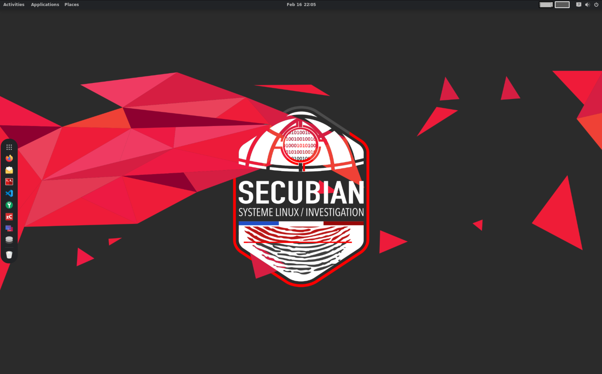
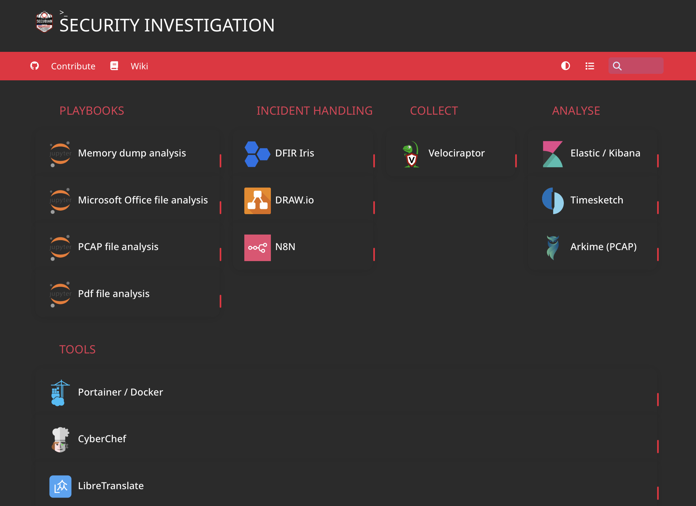

# SECUBIAN 

"SECUBIAN is a French Linux distribution focused on Incident Response."

SECUBIAN est un projet de distribution Linux permettant de mettre à disposition des équipes de réponse à incident la majorité des outils nécessaires à la collecte, le traitement et l'analyse de données.




## Les outils
La page d'accueil par défaut de Firefox, accessible via l'URL : [http://127.0.0.1:8080](http://127.0.0.1:8080/), permet de découvrir l'écosystème SECUBIAN via son wiki et les différentes solutions qui y sont présentes.



\
Les informations d'authentification nécessaires à l'usage de ces outils sont enregistrées dans la base de données keepass : ```$HOME/Documents/secubian.kdbx``` dont le mot de passe, par défaut, est ```secubian```. L'outil ```KeePassXC``` présent dans les raccourcis du dock permet d'y accéder.

Voici une liste non exhaustive des outils présents : 
- Collecte : dd, dc3dd, tcpdump
- Traitement : log2timeline, volatility2, volatility3
- Analyse : Zircolite, Timesketch (amd64 pour le moment), la stack Elastic, Capa, wireshark et à terme Arkime, règles SIGMA & YARA, MVT - Mobile Verification Toolkit
- Suivi d'incident : DFIR IRIS Web
- Autres : l'orchestrateur N8N, le traducteur déconnecté LibreTranslate, etc.. 

PS: D'autres outils dédiés aux domaines du Pentest et de l'OSINT sont également disponibles.

## La documentation
Le projet intègre 2 sous-projets dérivés nommés, [secubian-wiki](https://github.com/kidrek/secubian-wiki) et [secubian-JupyterNotebook](https://github.com/kidrek/secubian-JupyterNotebook). Ces derniers sont téléchargés en local dans le répertoire ``$HOME/Documents/Documentation`` et ``$HOME/Documents/Playbooks``, respectivement, de votre profil utilisateur. Ils permettent d'apporter de la documentation et de la méthodologie disponibles même OFFLINE.

## Investigation numérique

Un répertoire ```Cases``` est également présent dans le répertoire ```$HOME/Documents/``` de votre profil utilisateur, pour faciliter la gestion des preuves. \
Celles-ci pourront y être déposées pour analyse. 

